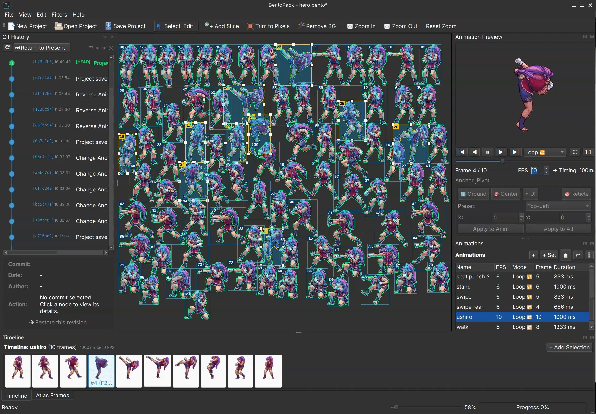

# 🍱 BentoPack

[](https://github.com/oktailb/BentoPack/actions/workflows/ci.yml)
[](https://opensource.org/licenses/Apache-2.0)
[](https://en.cppreference.com/w/cpp/17)
[](https://www.qt.io/)
[](https://cmake.org/)

> **BentoPack** is a fast, modular, and modern desktop application tailored for game developers, pixel artists, and 2D animators to pack, slice, arrange, edit, and export high-density 2D sprite sheets, tight polygonal meshes, and animated textures.
The entire project (UI, CLI, core engine, plugins, filters, and engine exporters) is 100% Free and Open Source under the **Apache License 2.0**. Official pre-compiled, auto-updating binaries are available for purchase on Steam and Itch.io for convenient 1-click desktop use.

---



---

## ✨ Key Features

### 📥 Intelligent Extraction & Codec Plugins
* **Native Aseprite (`.ase` / `.aseprite`) File Extraction:** Direct extraction of multi-layer, cel, frame, and animation tag definitions without requiring Aseprite installed. Automatically preserves blend modes and opacity.
* **Animated GIF Decompilation:** Instant extraction of multi-frame animated GIFs into ordered frame sequences.
* **Smart Sprite Sheet Slicing:** Automatic sprite detection and extraction with configurable alpha and color tolerance ($O(N)$ spatial grid).
* **Format Parsers & Importers:** Import existing sprite atlases with associated **JSON** (TexturePacker / Aseprite / Spine 2D / LibGDX) or **Godot 4 `.tres`** metadata.


<!-- 📸 SCREENSHOT À PRENDRE CE SOIR : Boîte de dialogue ou vue principale lors de l'import d'un fichier .aseprite animé avec ses calques et ses tags d'animations visibles -->

### 🖌️ Surgical Pixel-by-Pixel Editor & Layer Studio (M4 & M18)
* **High-Precision Canvas (`Ctrl+E`):** Fast, non-interpolated pixel art editor (`SmoothPixmapTransform = false`) with configurable pixel grid ($\ge 400\%$) for surgical touch-ups without switching to GIMP or Photoshop.
* **Complete Multi-Layer Architecture (`LayerStackWidget`):** Non-destructive layer stack with layer creation, duplication, deletion, drag-and-drop reordering, visibility toggle, opacity slider (0–100%), and 12 blend modes (*Normal, Multiply, Screen, Overlay, Darken, Lighten, Color Dodge, Color Burn, Hard Light, Soft Light, Difference, Exclusion*), plus *Merge Down* and *Flatten Image*.
* **Onion Skinning:** Configurable forward and backward frame ghosting with custom opacity and tint for fluid animation inbetweening and sub-pixel alignment.
* **Continuous Bresenham Drawing:** 1px pencil and 1px eraser guarantee continuous unbroken lines even during fast mouse sweeps.
* **Instant Sampling & Flood Fill:** Eyedropper (`Alt+Click` or `I`) and 4-way flood fill bucket bounded by sprite limits and active selection.
* **Flexible Selections & Floating Stamp:** Rectangular marquee and magic wand color selection; Cut (`Ctrl+X`), Copy (`Ctrl+C`), and Paste (`Ctrl+V`) with draggable floating stamp preview.
* **Modular 16 Retro & Arcade Palettes (`.gpl`):** Standard GIMP/Aseprite palette system dynamically loaded from disk:
  * **Nintendo:** NES / Famicom (54), SNES / 16-bit (32), Game Boy DMG (4), Game Boy Pocket (4)
  * **Sega:** Master System 8-bit (64), Mega Drive / Genesis 16-bit (64), Saturn / 32-bit (64)
  * **SNK:** Neo Geo AES / MVS Arcade (64)
  * **Computers & Fantasy:** Commodore 64 (16), Amiga OCS (32), NEC PC-Engine (32), IBM CGA Modes 1 & 2 (4), PICO-8 (16), Endesga EDG 32 (32), and Bento Studio Standard (36).
  * **Custom Palettes:** Auto-scanning of user palettes from `%APPDATA%/BentoPack/palettes/` and local `palettes/` folder (`.gpl`, `.hex`, `.pal`, or image sampling).
* **Integrated CDT Mesh & Laser Knife:** Direct polygon vertex editing and interactive edge-cutting knife tool inside the pixel editor.
* **Tabbed Ergonomics:** Right column split into distinct tabs separating tool options from the layer stack for clean workflow.
* **Inter-Frame Navigation:** `[◀ Previous]` and `[Next ▶]` buttons (`Page Up` / `Page Down`) allow touching up entire animation cycles frame by frame in a single session.
* **Two-Tier Undo/Redo:** Local stack for fine brush strokes and compound `EditSpritePixelsCommand` synchronizing frame and atlas texture seamlessly with `CompositionMode_Source`.


<!-- 📸 SCREENSHOT À PRENDRE CE SOIR : Éditeur de pixels (PixelEditorDialog) avec onglets calques actifs à droite, onion skin visible sur le canvas et palette rétro sélectionnée -->

### 📐 2D Polygon & Intelligent CDT Mesh Packing (M8 & M19)
* **Alpha Contour Extraction:** Automatic watertight Marching Squares contouring on sprite alpha silhouettes.
* **Intelligent Simplification:** Ramer-Douglas-Peucker (RDP) boundary reduction with outward normal dilation (0–8px padding) to prevent edge pixel clipping, with customizable vertex budget (3–48 vertices).
* **Constrained Delaunay Triangulation (CDT):** Feature-preserving mesh generation supporting Color Distance Mode and Sobel Edge Filter Mode.
* **Interactive Knife / Cut Tool (`mesh_knife`):** Draw laser cut lines across polygons to manually slice geometry and instantly re-triangulate concave or complex sections.
* **Direct Canvas Vertex Editing:** Click-drag individual vertices, multi-select vertices with `Shift` or `Ctrl`, nudge with arrow keys, double-click edge to insert a vertex, and hit `Delete` to remove vertices with automatic re-triangulation.
* **Batch Animation Propagation:** One-click option to apply the tuned polygon mesh across all frames of an animation sequence.
* **High-Density Tight Polygon Packing (Nesting):** Compaction allowing bounding boxes to overlap without pixel collisions. Multi-threaded candidate evaluation with configurable thread count (up to hardware cores) and sub-20ms instant calculation.
* **GPU Overdraw Reduction:** Slashes up to 60–80% of transparent pixel fillrate on mobile and desktop GPUs.
* **Multi-Engine Exports:** Godot 4 `_mesh.tres` (`ArrayMesh`), Unity `.unity.json` (`SpriteMeshType.Tight`), and Unreal Engine Paper2D `.paper2d.json`.


<!-- 📸 SCREENSHOT À PRENDRE CE SOIR : Dialogue de maillage CDT ou Pixel Editor affichant la triangulation fil de fer cyan/vert et l'outil couteau laser en cours de tracé -->

### 🎨 Non-Destructive Filter & Cleanup Suite (M7)
* **Frame Context Menu & Targeted Scope:** Right-click directly on any sprite in the atlas or timeline to apply filters to the current selection, the whole frame, or batch-apply to all frames in the animation.
* **Live Debounced Preview & Universal Undo:** Real-time feedback with non-destructive rollback via `QUndoStack` (`ApplyFilterCommand`) across 9 specialized filters:
  * **Chroma Background Removal (`Ctrl+Shift+B`):** Dominant color auto-detection, alpha thresholding, and smart crop.
  * **Despill / Anti-Halo:** Clean up 1-pixel colored fringes left by antialiased edges using *Color Clamping* or strict removal.
  * **Outline & Silhouette Generator:** 1-4px customizable stroke (4-connected or 8-connected) and solid hit-flash silhouette masks.
  * **Color Swap (Alt-Skins):** Instant palette replacement preserving pixel art shading gradients (HSV).
  * **Color Adjustment:** Real-time Hue, Saturation, Value, Brightness, and Contrast grading.
  * **Retro Palette & Bayer Dithering:** Color quantization to 16 historical hardware palettes with Bayer dithering (2x2, 4x4, 8x8) or Floyd-Steinberg, with adjustable strength slider.
  * **Pixel Art Rescale:** Pixel-perfect integer rescaling without bilinear blurring.
  * **Atlas Bin-Packing (MaxRects) (`Ctrl+Shift+P`):** Multi-heuristic 2D box packing (Best Short Side Fit, Best Area Fit, Best Long Side Fit, Bottom Left, Contact Point).
  * **Tight Polygon Packing (Nesting) (`Ctrl+Shift+T`):** Multi-threaded high-density concave/convex polygon packing allowing bounding boxes to overlap.


<!-- 📸 SCREENSHOT À PRENDRE CE SOIR : Dialogue du filtre RetroPalette affichant une palette rétro (Sega, Neo Geo, NES...) avec tramage Bayer actif et aperçu avant/après -->

### 🎬 Timeline & Animation Filmstrip (M2)
* **Filmstrip Dock:** Intuitive bottom timeline with thumbnail filmstrip, scrub bar, and drag-and-drop frame reordering.
* **Frame Merging & Compositing:** Drag and drop one frame onto another to fuse them into a single layered sprite.
* **Batch Editing:** Multi-selection operations including group deletion, invert selection, and reverse frame ordering (ideal for ping-pong loops).
* **Real-time Playback:** High-precision preview engine with configurable FPS (1 to 60 FPS), loop controls (Loop, Once, Ping-Pong), and aspect-ratio stabilization.


### 🎯 Interactive Anchor Points & Pivots (M3)
* **Zero-Jittering Animation Stabilization:** Shared animation envelope alignment guarantees rock-solid anchored characters during motion, attacks, or jumps without visual shaking or sliding.
* **Dual-Surface Direct Editing:** Move the high-contrast reticle directly within the atlas slices or right inside the live animation preview with real-time coordinate updates and Shift+Click snapping.
* **Instant Cardinal Presets & Batch Actions:** One-click shortcuts for Ground/Bottom-Center, Center, and Top-Left (UI), with batch propagation to entire animations or the full project.
* **Intelligent Preview Navigation:** Automatic optimal framing (*Fit In View*), 5000% razor-sharp pixel art wheel zoom, and pan controls.

### 🍱 Native `.bento` Project Architecture (M5)
* **All-in-One Compressed Format:** `.bento` project files package project metadata, frame descriptors, and source assets into a structured ZIP archive.
* **Atomic Transactions & Crash Recovery:** Atomic file writing with journaled crash-recovery safeguard prevents project corruption.
* **Embedded Git Time-Travel:** Integrated non-destructive versioning engine powered by LibGit2. Browse commit history, inspect visual diffs, and revert to previous states without leaving the app.

### 📤 Multi-Engine Export
* **PNG Sprite Atlas:** Optimized packing of extracted frames into a consolidated texture sheet.
* **Non-Blocking Background Export:** Heavy compression tasks (KTX2 UASTC, high Zstd levels) run asynchronously via `QtConcurrent` with animated progress status, keeping the GUI perfectly responsive.
* **Godot 4 Engine Exporter:** Generates ready-to-use Godot 4 `SpriteFrames` (`.tres`) resources with embedded `AtlasTexture` definitions, animations, and companion `_mesh.tres` 2D `ArrayMesh` resources.
* **Unity 2D SpriteSheet Exporter:** Generates `.unity.json` metadata compatible with Unity's `SpriteMeshType.Tight`, including normalized UVs, inverted Y-axis coordinates, and face indices.
* **Unreal Engine Paper2D Exporter:** Generates `.paper2d.json` descriptors containing both render and collision polygon geometries.
* **TexturePacker / Aseprite JSON:** Universal JSON metadata mapping frame bounds `(x, y, w, h)`, animation tags, and optional mesh geometry (`vertices`, `verticesUV`, `triangles`).

### 🚀 GPU VRAM Hardware Texture Compression (M9)
* **Direct GPU Memory Upload (Zero CPU Decompression Overhead):** Bypasses CPU software raster decompression at game runtime. Uploads blocks straight into VRAM, slashing memory bus bandwidth and reducing game asset load times to near-zero.
* **Universal KTX2 Containers & Khronos Basis Universal:** Powered by Khronos `basis_universal` (v2.50) with multi-threaded C++ encoding.
* **UASTC 4x4 Mode (Recommended for Pixel Art):** High-fidelity 8 bpp block compression delivering **75.0% VRAM memory savings** while preserving crisp sprite pixel contours and delicate alpha antialiasing. Transcodes on-the-fly to native GPU formats: **ASTC** (iOS, Android, Switch, Apple Silicon), **BC7** (PC DirectX 11/12, Vulkan, PS5, Xbox), or **ETC2**.
* **ETC1S Ultra-Compact Mode:** Global codebook vector quantization yielding up to **87.5% VRAM footprint reduction** for lightweight UI and mass sprite textures.
* **Lossless Zstandard Supercompression:** Integrated Zstd compression (levels 1 to 22) shrinking file size on disk while retaining GPU block layout.
* **Live VRAM Telemetry in ExportDialog:** Real-time feedback comparing raw RGBA8888 vs UASTC/ETC1S memory footprint with instant percentage savings.
* **Integrated Game Engine Companions:** Emits `.ktx2` companion atlas files natively referenced by Godot 4 (`res://atlas.ktx2`), Unity (`KtxUnity`), Unreal Engine, and WebGL/WebGPU.

### ⚙️ Comprehensive Settings & Preferences Center
* **Modular 6-Category Configuration:** Clean searchable preferences interface with responsive filtering.
* **Multilingual UI (i18n):** Complete localization in English, French (Français), and Japanese (日本語) with hot-switch in Preferences.
* **Startup & Automation:** Auto-reopen last active `.bento` project and optional background check for newer GitHub releases.
* **Export & VRAM Defaults:** Pre-configure favorite target engines, texture format, packing algorithm, and Zstd level.
* **Plugin Management:** Real-time inspection of loaded filter and extractor plugins with metadata, supported extensions, and hot-reload.
* **Integrated Update Engine:** Direct GitHub releases API query, markdown release notes preview, and instant version comparison.

---

## 🛠️ Tech Stack & Architecture

* **Language:** C++17
* **Framework:** Qt 6 (Core, Gui, Widgets, Multimedia, Concurrent, Network, Test, LinguistTools)
* **Core Engine:** `libBentoPackCore` shared library with clean exported API symbols (`BENTOPACK_CORE_EXPORT`) and `libBentoPackWidgets` (`BENTOPACK_WIDGETS_EXPORT`)
* **Dynamic Plugin System:** Hot-loadable Qt 6 plugins (`QPluginLoader`) for both **Filters** (`plugins/filters/`) and **Codecs / Extractors** (`plugins/extractors/`)
* **Plugin Developer SDK:** Installed public headers, CMake package configuration (`BentoPackConfig.cmake`), and reference examples (`examples/sample_filter_plugin`, `examples/sample_extractor_plugin`)
* **Hardware Texture Compression:** Khronos `basis_universal` (v2.50) integration for direct GPU memory upload (KTX2, UASTC, ETC1S, Zstd)
* **Build System:** CMake 3.20+ with modular architecture (`BentoPackCore` + `BentoPack` GUI + `bentopack-cli` + 15 automated CTest suites)
* **Versioning Engine:** LibGit2 (optional, enabled when detected)

---

## 💻 Building and Running

### Prerequisites

* **C++17 compliant compiler:** GCC 11+, Clang 13+, or MSVC 2019/2022
* **CMake:** Version 3.20 or newer
* **Qt 6:** Version 6.5 or newer (Core, Gui, Widgets, Multimedia, MultimediaWidgets, Concurrent, Test, LinguistTools)
* **Ninja** or **Make** (recommended build generators)
* *(Optional)* **LibGit2** (for embedded `.bento` time-travel versioning)

### Build Instructions

#### Linux (Ubuntu / Debian)

```bash
# 1. Install prerequisites
sudo apt-get update
sudo apt-get install -y build-essential cmake ninja-build \
  qt6-base-dev qt6-multimedia-dev qt6-tools-dev libgit2-dev

# 2. Clone repository
git clone https://github.com/oktailb/BentoPack.git
cd BentoPack

# 3. Configure and build
cmake -B build -G Ninja -DCMAKE_BUILD_TYPE=Release
cmake --build build

# 4. Run tests
ctest --test-dir build --output-on-failure

# 5. Launch
./build/bin/BentoPack
```

#### Windows (MinGW 64-bit or MSVC)

```powershell
# 1. Clone repository
git clone https://github.com/oktailb/BentoPack.git
cd BentoPack

# 2. Configure with CMake
cmake -B build -DCMAKE_BUILD_TYPE=Release

# 3. Build project
cmake --build build --config Release --parallel

# 4. Run automated test suite
ctest --test-dir build --output-on-failure -C Release

# 5. Launch
.\build\bin\BentoPack.exe
```

---

## 🧪 Automated Testing

BentoPack includes an exhaustive test suite powered by `QtTest` and `CTest`, validating core models, codecs, controllers, plugins, filters, and multithreaded pipelines across 15 dedicated suites (**100% CTest pass rate**):

```bash
ctest --test-dir build --output-on-failure --verbose
```

| Test Suite | Description |
| :--- | :--- |
| `test_core` | Frame data structures, color detection, and algorithm utilities |
| `test_project` | `.bento` serialization, atomic saves, journal crash recovery, and LibGit2 versioning |
| `test_extractors` | Native Aseprite (`.ase`/`.aseprite`), GIF, JSON, Godot 4 `.tres`, and Sprite Sheet detectors using sample assets |
| `test_controller_project` | Project lifecycle, document state management, and file operations |
| `test_controller_animation` | Timeline controller, FPS pacing, loop modes, and frame reordering |
| `test_controller_atlas` | Atlas slicing, box editing, pivot alignment, and nudge operations |
| `test_filters` | Image processing pipeline: Despill, Outline, Color Swap, Color Adjust, Pixel Rescale, Retro Palette & Bayer dithering (13 tests) |
| `test_mesh` | Watertight Marching Squares, RDP boundary reduction, Constrained Delaunay Triangulation (CDT), knife tool, tight polygon packing, and engine exports (22 tests) |
| `test_pixel_editor` | 1px Bresenham drawing, multi-layer stack, onion skinning, 16 dynamic retro `.gpl` palettes, CDT mesh synchronization (47 tests) |
| `test_vram_compression` | Khronos KTX2 containers, UASTC 4x4 & ETC1S compression, Zstd supercompression, and GPU transcoding roundtrips (12 tests) |
| `test_cli` | Headless CLI parser, TexturePacker & Aseprite batch emulation, Godot 4 generator, and POSIX exit codes |
| `test_app_config` | Settings manager, persistence, preferences serialization, and theme/i18n options |
| `test_robustness` | Corrupted inputs, zero-size images, memory limit guards, and stress resilience |
| `test_gui_integration` | Dialog workflows, UI state synchronization, and widget interaction validation |
| `test_concurrency_and_security` | Thread safety, race-condition mitigation, and safe path traversal checks |

---

## ⚡ Command-Line Interface (`bentopack-cli`)

BentoPack includes an autonomous, 100% headless console binary **`bentopack-cli`** (symlinked to `bentopack-cli` for backward compatibility) designed for game studio build pipelines and CI/CD runners (zero GUI/display required):

### TexturePacker Drop-In Mode (with KTX2 VRAM Compression)
Replaces `TexturePacker` directly in existing build scripts without modifying Makefile or CMake commands:
```bash
# Standard PNG packing
bentopack-cli --sheet atlas.png --data atlas.json \
  --format json-array --algorithm MaxRects --maxrects-heuristics BestShortSideFit \
  --padding 2 --extrude 1 --trim-mode Trim --size-constraints POT \
  --enable-auto-alias assets/sprites/*.png

# Direct GPU Hardware Texture Compression (KTX2 UASTC 4x4 with Zstd)
bentopack-cli --sheet atlas.ktx2 --data atlas.json \
  --texture-format ktx2 --opt ASTC_4x4 --zstd-level 9 assets/sprites/*.png
```

### Aseprite Batch Mode
```bash
bentopack-cli -b sprites/*.png --sheet atlas.png --data atlas.json \
  --sheet-type packed --list-tags
```

### Godot 4 Native Resource & Scene Generation
Generates complete `.tres` `SpriteFrames` with jitter-free margins, UID stability across builds, companion `.ktx2` texture, and an instantiable `.tscn` scene:
```bash
bentopack-cli pack --format godot4 \
  --sheet res/player_atlas.ktx2 --data res/player_frames.tres \
  --godot-scene res/player.tscn assets/player/*.png
```

### Native Headless Slicing, Filters & Bento Projects
```bash
# Auto-slice raw sheet into individual sprites with background removal
bentopack-cli slice --remove-bg --tolerance 15 --smart-crop --output-dir out/ sheet.png

# Apply procedural outline headless
bentopack-cli filter --outline 2 red --output-dir out/ sprites/*.png

# Inspect or export .bento project metadata
bentopack-cli bento --info project.bento
```

### Reactive Watch & Multi-Instance Daemon (`--watch`)
Live background surveillance with intelligent burst debouncing and directory-isolated locking (`QLockFile`):
```bash
# Interactive watch with 300ms burst debouncing
bentopack-cli pack --sheet atlas.png --data atlas.json --watch assets/sprites/

# Multi-instance daemon mode (isolated per directory)
bentopack-cli pack --sheet char_atlas.png --data char.json --watch --daemon assets/characters/
bentopack-cli pack --sheet ui_atlas.png --data ui.json --watch --daemon assets/ui/

# Stop active daemon guarding a specific folder
bentopack-cli --stop-watch assets/characters/
```

### Transparent Drop-In Wrappers
Ready-to-use scripts located in `wrappers/` allow legacy makefiles to call `TexturePacker` or `aseprite` seamlessly:
```bash
# Windows
wrappers\TexturePacker.bat --sheet atlas.png --data atlas.json sprites/*.png

# Linux / macOS
wrappers/TexturePacker --sheet atlas.png --data atlas.json sprites/*.png
```

### Benchmarks & Regression Tracking
Execute the autonomous 24-scenario benchmark suite with performance diffing and KPI reporting:
```bash
python scripts/benchmark_cli.py
```
Reports are automatically written to [`benchmarks/REPORT.md`](benchmarks/REPORT.md) with historical tracking snapshots in `benchmarks/history/`.

---

## 📚 Documentation

Comprehensive documentation is available in the [`docs/`](docs/) directory:
* **[User Guide](docs/USER_GUIDE.md):** Complete, step-by-step illustrated manual covering atlas slicing, timeline animations, anchor pivots, filters, MaxRects & tight mesh packing, surgical pixel editing, and multi-engine exports.
* **[Developer & Extension Guide](docs/DEVELOPER_GUIDE.md):** Architectural deep-dive, step-by-step tutorial for writing custom I/O codecs (`Extractor`) and image filter plugins (`FilterPlugin`), memory scanline best practices, and headless unit testing.
* **API Reference (Doxygen):** Build the complete C++ API reference with interactive inheritance graphs by running `cmake --build build --target doxygen` (outputs to `build/docs/html/index.html`).
* **UNIX Manual Pages:** Traditional troff/groff manpages for [`bentopack(1)`](docs/man/bentopack.1) and [`bentopack-cli(1)`](docs/man/bentopack-cli.1).

---

## ⚔️ Comparison & Market Positioning

BentoPack bridges the gap between raw asset extraction/cleanup (historically handled by tools like *ShoeBox*), sprite atlas packing (*TexturePacker*), and animation sequencing (*Aseprite / Pixelorama / Godot SpriteFrames*).

| Feature / Criterion | **BentoPack** | **TexturePacker** | **Aseprite** | **Pixelorama** | **ShoeBox** *(Discontinued)* | **Free Texture Packer** | **Godot 4 Editor** *(Built-in)* |
| :--- | :---: | :---: | :---: | :---: | :---: | :---: | :---: |
| **License & Pricing** | **Open-Source (Apache 2.0)** | Commercial (~40€) | Commercial (~20€) / Source | **Open-Source (MIT)** | Free (Abandoned) | Open-Source (MIT) | Integrated (MIT) |
| **Core Technology** | C++17 / Qt 6 | C++ / Qt | C++ / Skia | GDScript / Godot Engine | Adobe AIR / Flash | Electron / Web | C++ / Godot Core |
| **Smart Atlas Slicing & Import** | 🟢 **Advanced (O(N) SpatialGrid, Native Aseprite `.ase`, GIF, JSON)** | 🔴 None (requires loose images) | 🟡 Basic | 🔴 None (canvas drawing) | 🟢 Historic pioneer | 🔴 None (requires loose files) | 🟡 Basic (Grid / Alpha) |
| **Live Filters & Background Cleanup** | 🟢 **Yes (Plugin Registry, Despill, Outline, Color Swap, Bayer Dither)** | 🔴 None | 🔴 Manual | 🟡 Basic image effects | 🟢 Historic (BG only) | 🔴 None | 🔴 None |
| **Timeline & Filmstrip** | 🟢 **Yes (Filmstrip, Ping-Pong)** | 🔴 None (Static preview) | 🟢 **Full animation studio** | 🟢 **Full animation studio** | 🔴 None | 🔴 None | 🟢 Engine-integrated |
| **Packing Algorithms** | 🟢 **MaxRects (5 heuristics), Tight Polygon Nesting (Multithreaded), Shelf, Grid, Auto-Alias, Extrude** | 🟢 **Industry Leader (MaxRects, Polygon)** | 🟡 Basic Sprite Sheet | 🟡 Basic Sprite Sheet | 🟡 Basic Shelf | 🟢 MaxRects | 🔴 Manual atlas |
| **2D Mesh & Tight Polygon Slicing** | 🟢 **Yes (Marching Squares, Ear-Clipping, CDT, Knife Tool, Godot/Unity/Unreal)** | 🟢 Commercial Feature | 🔴 None | 🔴 None | 🔴 None | 🔴 None | 🟡 Collision Polygon only |
| **Surgical Pixel Editor** | 🟢 **Yes (Bresenham 1px, Multi-Layers, Onion Skin, 16 Retro Palettes, CDT Mesh)** | 🔴 None | 🟢 **Full illustration editor** | 🟢 **Full illustration editor** | 🔴 None | 🔴 None | 🔴 None |
| **Anchor Points / Pivots** | 🟢 **Yes (Interactive Reticle, Zero-Jittering, Godot 4 / JSON)** | 🟢 Yes (All presets) | 🟢 Yes (Canvas origin) | 🟡 Canvas origin | 🟡 Basic | 🟢 Yes | 🟢 Yes |
| **Embedded Time-Travel** | 🟢 **Unique (Git / LibGit2 dock)** | 🔴 None | 🔴 Local undo only | 🔴 Local undo only | 🔴 None | 🔴 None | 🟡 External Git |
| **Godot 4 Integration** | 🟢 **Native (`.tres` SpriteFrames & `.tscn`)** | 🟢 Supported | 🟡 Via community plugins | 🟢 **Native (Built in Godot)** | 🔴 None | 🟡 JSON export | 🟢 Native |
| **Headless CLI for CI/CD** | 🟢 **Yes (`bentopack-cli`, TexturePacker, Aseprite, Godot 4)** | 🟢 **Industry standard** | 🟢 Full CLI | 🟡 Basic Godot CLI flags | 🔴 None | 🟢 npm CLI | 🟢 Headless Godot |
| **VRAM Texture Compression** | 🟢 **Native KTX2, UASTC, ETC1S, Zstd, Direct GPU Zero-Decompress, CLI** | 🟢 **ASTC, ETC2, KTX2, Basis (Commercial)** | 🔴 PNG / GIF | 🔴 PNG | 🔴 PNG | 🟡 TinyPNG API | 🟢 Engine import |

> [!TIP]
> **Why BentoPack?** While *TexturePacker* excels at packing clean loose PNGs for AAA pipelines and *Aseprite* / *Pixelorama* are dedicated pixel art authoring tools, **BentoPack** is uniquely built to **rescue, decompile, clean, organize, and bridge existing 2D sheets** into production-ready game engine resources without external dependencies.

---

## 📄 Licensing & Distribution Model

BentoPack is distributed as **100% Free and Open Source Software (FOSS)**:

* **Entire Codebase (Apache License 2.0):**
  The entire application, CLI, algorithmic engine, filters, extractors, and engine addons are licensed under the permissive **Apache License 2.0**. You are free to compile, modify, inspect, and use BentoPack in any personal or commercial game project without royalty fees, revenue restrictions, or gatekeeper locks. See [LICENSE](file:///LICENSE).
* **Official Binaries (Store Convenience):**
  For creators who prefer an out-of-the-box experience without building from source, official pre-compiled binaries featuring 1-click installers, code signing, and automatic updates are available on **Steam** and **Itch.io**. Purchases directly support ongoing open-source development.

**Developer:** Vincent LECOQ
