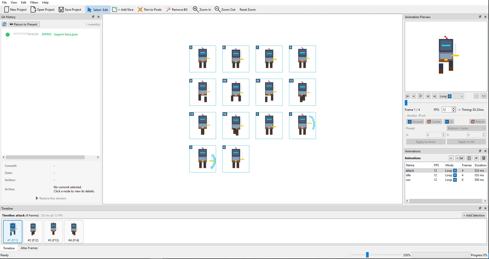
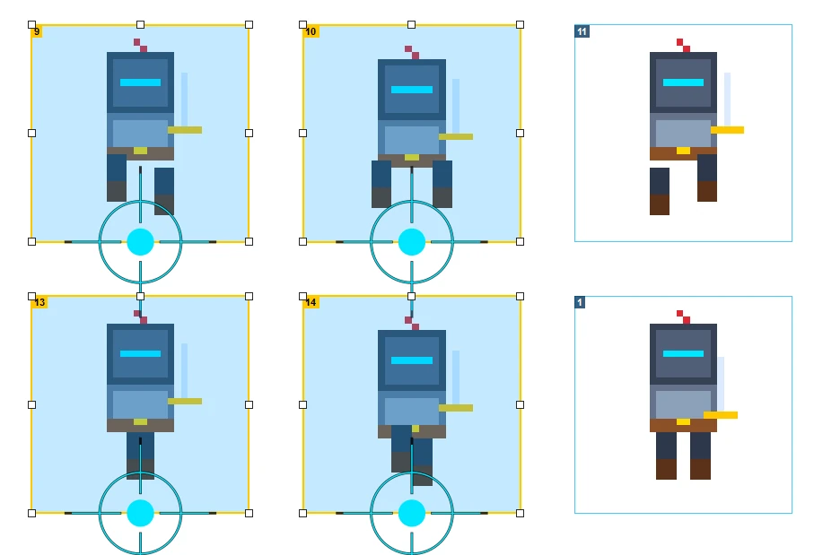
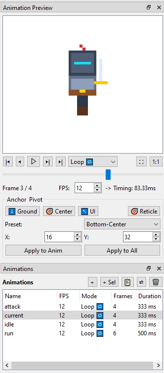

# 📖 Manuel de l'Utilisateur — BentoPack

Bienvenue dans le manuel d'utilisation officiel de **BentoPack**, l'atelier tout-en-un pour la préparation, la retouche chirurgicale, le séquençage d'animations et l'exportation optimisée de planches de sprites 2D pour le jeu vidéo et le pixel art.

---

## 📑 Table des Matières
1. [Prise en Main & Interface Principale](#1-prise-en-main--interface-principale)
2. [Découpe & Gestion des Bounding Boxes (Slicing)](#2-découpe--gestion-des-bounding-boxes-slicing)
3. [Gestionnaire d'Animations & Timeline Filmstrip](#3-gestionnaire-danimations--timeline-filmstrip)
4. [Points d'Ancrage & Pivots (Éradication du Séquençage Flottant)](#4-points-dancrage--pivots-éradication-du-séquençage-flottant)
5. [Suite de Filtres Graphiques & Traitement d'Image](#5-suite-de-filtres-graphiques--traitement-dimage)
6. [Empaquetage d'Atlas MaxRects (Compacité Optimale)](#6-empaquetage-datlas-maxrects-compacité-optimale)
7. [Empaquetage Polygonal & Maillages Serrés (Tight Mesh)](#7-empaquetage-polygonal--maillages-serrés-tight-mesh)
8. [Atelier d'Édition Pixel par Pixel Chirurgicale](#8-atelier-dédition-pixel-par-pixel-chirurgicale)
9. [Format de Projet Natif (`.bento` / `.ssp`) & Voyage dans le Temps Git](#9-format-de-projet-natif-bento--ssp--voyage-dans-le-temps-git)
10. [Exportations Multi-Moteurs (Godot, Unity, Unreal, JSON)](#10-exportations-multi-moteurs-godot-unity-unreal-json)
11. [Automatisation en Ligne de Commande (`bentopack-cli`)](#11-automatisation-en-ligne-de-commande-bentopack-cli)
12. [Mémento des Raccourcis Clavier](#12-mémento-des-raccourcis-clavier)

---

## 1. Prise en Main & Interface Principale

L'interface de BentoPack est conçue pour maximiser l'espace de travail visuel tout en maintenant les outils de précision accessibles.



### Les Espaces de Travail :
- **Zone Centrale (Vue Atlas) :** Visualisation haute résolution de la texture d'atlas. Prise en charge du zoom molette fluide jusqu'à $5000\%$ sans flou (interpolation bilinéaire désactivée) et navigation panoramique par maintien du clic milieu ou barre d'espace.
- **Panneau Latéral Gauche (Liste des Frames) :** Vignettes dynamiques de toutes les tranches isolées avec leur index et dimensions.
- **Panneau Inférieur (Timeline & Lecteur d'Animation) :** Filmstrip horizontal interactif pour orchestrer et prévisualiser les animations avec contrôle précis du framerate (FPS).
- **Inspecteur de Droite :** Propriétés de la frame sélectionnée (coordonnées $X, Y, W, H$, configuration du pivot, métadonnées).
- **Splitters Redimensionnables :** Ajustez librement la hauteur et la largeur de chaque panneau selon vos besoins d'affichage.

---

## 2. Découpe & Gestion des Bounding Boxes (Slicing)

Découpez rapidement une planche de sprites composite en frames exploitables.



### Modes de Découpe :
- **Détection Automatique Intelligente :** Accessible via *Outils > Détecter les Sprites* (`Ctrl+Shift+D`). Analyse le canal alpha et isole automatiquement chaque îlot de pixels en une fraction de seconde ($< 20$ ms sur un atlas $1024\times 1024$).
- **Outil de Découpe Manuelle (`ToolAddSlice`) :** Sélectionnez l'outil Découper (`N` ou bouton ciseau) et tracez un rectangle à la souris sur l'atlas.
- **Tranche Carrée Parfaite :** Maintenez la touche `Shift` enfoncée pendant le tracé pour contraindre le rectangle en un carré parfait ($1:1$).

### Manipulation des Boîtes Englobantes :
- **Sélection Simple & Multiple :** Cliquez sur une boîte pour la sélectionner. Pour une sélection multiple, maintenez `Ctrl` ou tracez un rectangle de sélection lasso (*Marquee Selection*).
- **Poignées de Redimensionnement :** 8 poignées interactives permettent d'ajuster les bordures au pixel près.
- **Déplacement Groupé :** Cliquez et glissez l'une des boîtes sélectionnées pour déplacer l'ensemble du groupe.
- **Ajustement Fin au Clavier (*Nudge*) :**
  - Flèches directionnelles : déplacement de $1\text{ px}$.
  - `Shift + Flèches` : déplacement rapide de $10\text{ px}$.
- **Rognage Automatique (*Trim*) :** Appuyez sur `T` pour resserrer la boîte active au plus près des pixels non transparents.

---

## 3. Gestionnaire d'Animations & Timeline Filmstrip

Créez, cadenciez et validez vos cycles de marche, attaques et sauts en temps réel.



### Gestion des Séquences :
- **Création d'Animation :** Cliquez sur le bouton `+` ou appuyez sur `Ctrl+N` dans le panneau d'animation pour ajouter une séquence (ex: `idle`, `walk`, `attack`).
- **Cadence d'Images (FPS) :** Ajustez la vitesse de lecture indépendamment pour chaque animation de $1$ à $60\text{ FPS}$ (défaut : $12\text{ FPS}$).
- **Modes de Boucle :**
  - **Loop (Boucle continue) :** Idéal pour la marche, la course ou la respiration.
  - **Once (Lecture unique) :** Idéal pour les attaques ou la mort (s'arrête à la dernière frame).
  - **Ping-Pong (Aller-retour) :** Idéal pour les animations oscillantes ou les effets de brillance.

### Montage Interactif sur Filmstrip :
- **Glisser-Déposer de Frames :** Glissez des vignettes depuis la liste des frames directement sur la timeline pour les ordonner.
- **Réorganisation Temporelle :** Déplacez les vignettes le long du filmstrip pour changer l'ordre de la séquence.
- **Contrôles de Lecture :** Barre d'espace pour Play/Pause, touches `J` et `L` pour avancer/reculer d'une frame, `K` pour stopper.
- **Inversion d'Animation :** Clic droit sur l'animation > *Inverser la séquence* pour créer instantanément l'animation inverse.

---

## 4. Points d'Ancrage & Pivots (Éradication du Séquençage Flottant)

En jeu vidéo 2D, une animation dont les frames ont des largeurs variables saute visuellement ("jittering") si le point d'ancrage n'est pas calé au sol ou au centre de gravité du personnage.


### Fonctionnalités du Système de Pivots :
- **9 Presets Cardinaux Instantanés :**
  - Coin supérieur gauche, Haut, Coin supérieur droit
  - Centre gauche, **Centre absolu**, Centre droit
  - Coin inférieur gauche, **Bas centre (Sol - recommandé pour personnages)**, Coin inférieur droit.
- **Mire Interactif Déplaçable :**
  - Un réticule haute visibilité (croix cyan/magenta) s'affiche sur la boîte active.
  - Attrapez le réticule à la souris et glissez-le n'importe où (même en dehors de la frame).
- **Synchronisation Bidirectionnelle :**
  - Toute modification sur l'atlas met à jour la vue d'aperçu d'animation, et vice-versa.
- **Guides Visuels d'Alignement :**
  - **Ligne de Sol (*Ground Line*) :** Activez la ligne de sol pour aligner les pieds de vos personnages sur toutes les frames.
  - **Enveloppe Commune (*Bounding Hull*) :** Affiche la boîte englobante maximale de l'animation pour détecter les débordements d'armes ou de capes.

---

## 5. Suite de Filtres Graphiques & Traitement d'Image

Nettoyez vos planches rips, éliminez les halos et générez des variantes sans ouvrir d'éditeur externe lourd.


### 1. Suppression d'Arrière-Plan & Détourage (`Ctrl+B`) :
- **Échantillonnage Automatique :** Détecte la teinte de fond prédominante (ex: vert #00FF00 ou rose fuchsia).
- **Curseur de Tolérance :** Ajuste la proximité colorimétrique pour nettoyer le bruit de compression JPEG.
- **Découpe Intelligente (*Smart Crop*) :** Supprime les bordures transparentes superflues.


### 2. Débavurage & Anti-Halo (*Despill*) :
- Neutralise le liséré indésirable de 1 pixel qui subsiste après un détourage grâce au mode exclusif *Color Clamping* (substitution de teinte sans amputer les contours fins du sprite).

### 3. Générateur de Contours & Silhouettes (*Outline*) :
- Crée un liseré extérieur net de 1 à 4 pixels (idéal pour détacher un personnage de l'arrière-plan).
- **Mode Silhouette Pleine :** Génère un masque uni pour créer un flash de dégât (*hit-flash*) ou une ombre projetée.

### 4. Échange de Palette & Variantes (*Color Swap / Alt-Skins*) :
- Remplace une couleur par une autre tout en préservant subtilement les dégradés et nuances d'ombrage (espace colorimétrique HSV Shading). Idéal pour créer des variantes d'ennemis ou des costumes Joueur 2.

### 5. Ajustements Colorimétriques HSV (*Color Adjust*) :
- Sliders bidirectionnels pour la Teinte ($-180^\circ$ à $+180^\circ$), la Saturation, la Luminosité et le Contraste.
- Possibilité d'appliquer le filtre sur l'ensemble de l'atlas ou uniquement sur les frames sélectionnées.

### 6. Redimensionnement Pixel Art Net (*Pixel Rescale*) :
- Facteurs entiers ($2\times$, $3\times$, $4\times$) ou fractionnaires ($0.5\times$).
- Moteurs : **Nearest-Neighbor** (pixels nets absolus) ou **Scale2x / Scale3x** (lissage procédural sans flou des arêtes diagonales).

### 7. Palettes Rétro Authentiques & Tramage (*Retro Palette Filter*) :
- Presets matériels fidèles : Game Boy DMG, Game Boy Pocket, NES / Famicom, PICO-8, Commodore 64, CGA, Endesga 32.
- Importation de fichiers de palettes externes : `.hex` (Lospec), `.gpl` (GIMP/Aseprite), `.pal`.
- **Tramage ordonné (*Ordered Bayer Dithering*) :** Matrices $2\times 2$, $4\times 4$ ou $8\times 8$ avec intensité réglable ($0\%$ à $100\%$).

---

## 6. Empaquetage d'Atlas MaxRects (Compacité Optimale)

Optimisez la disposition de vos sprites pour réduire la mémoire vidéo (VRAM) et le poids de vos jeux.


### Atouts Clés :
- **Algorithme MaxRects 2D :** Heuristiques *Best Short Side Fit* (BSSF) et *Best Area Fit* (BAF) offrant une densité de rangement comparable aux meilleurs outils professionnels.
- **Déduplication Automatique (*Auto-Aliasing*) :**
  - Détecte les frames rigoureusement identiques (pixel par pixel).
  - Fusionne les doublons dans l'atlas tout en préservant intacte la timeline de vos animations : les séquences continuent de défiler normalement en pointant vers l'unique frame canonique.
- **Extrusion de Bordure (Bleeding Prevention) :**
  - Duplique les pixels extérieurs de $1\text{ px}$ pour éradiquer les artefacts de lignes parasites lors du filtrage bilinéaire ou mipmapping en moteur 3D/2D.
- **Dimensions Puissance de Deux (*Power of Two*) :**
  - Contraint l'atlas en dimensions optimales pour les GPUs mobiles ($512\times 512$, $1024\times 1024$, $2048\times 2048$).
- **Prévisualisation en Direct & Annulation :** `Ctrl+Shift+P` ouvre le dialogue interactif avec prévisualisation immédiate et prise en charge de `Ctrl+Z`.

---

## 7. Empaquetage Polygonal & Maillages Serrés (Tight Mesh)

Sur smartphone, Nintendo Switch ou consoles portables, l'overdraw GPU (coût de calcul des pixels transparents) pénalise lourdement le framerate. Le packing polygonal remplace les rectangles par des enveloppes épousant au plus près la silhouette du sprite.


### Caractéristiques Métier :
- **Économie de Fillrate de 60% à 80% :** Les shaders ne sont exécutés que sur la zone opaque utile.
- **Algorithme Marching Squares :** Contournement sous-pixel étanche et sans risque de décrochage.
- **Simplification RDP avec Dilatation Normale :** Repousse les sommets vers l'extérieur de quelques pixels pour garantir qu'aucun détail d'art fin ne soit amputé.
- **Budget de Sommets Paramétrable :** Limitez le nombre de points ($3$ à $48$ sommets) pour respecter les contraintes de polygones de votre moteur de jeu.
- **Édition Directe des Sommets sur le Canevas :**
  - Cliquez sur un sommet pour le déplacer.
  - Double-cliquez sur une arête pour insérer un nouveau point.
  - Touche `Suppr` pour retirer un sommet superflu.
- **Tight Polygon Packing Multithreadé :**
  - Les formes s'imbriquent comme des pièces de puzzle (ex: une épée pointue se glisse sous le bras d'un autre sprite).
  - Gain de compacité d'atlas de $+20\%$ à $+50\%$.
  - Sélection du nombre de threads de calcul ($1$ à $N$ cœurs logiques).

---

## 8. Atelier d'Édition Pixel par Pixel Chirurgicale

Corrigez rapidement un pixel mal placé, un artefact oublié ou harmonisez une couleur sans quitter BentoPack. Raccourci : `Ctrl+E` ou clic droit sur une frame > *Éditer les pixels...*.


### Boîte à Outils Complète :
- **Pinceau 1px (`P`) :** Tracé continu haute précision basé sur l'algorithme de ligne continue de Bresenham. Clic gauche pour la couleur primaire, clic droit pour la couleur secondaire.
- **Gomme 1px (`E`) :** Rétablit le pixel à `alpha = 0` (transparence pure).
- **Pipette Eyedropper (`I` ou `Alt + Clic`) :** Prélèvement instantané d'une couleur sur le canevas.
- **Seau de Remplissage (`G`) :** Remplissage par flot 4-connecté borné par la couleur et la sélection active.
- **Outils de Sélection :**
  - Sélection rectangulaire (*Marquee* `M`).
  - Baguette magique colorimétrique (*Wand* `W`) : sélectionne instantanément tous les pixels de teinte identique.
  - Désélectionner (`Ctrl+D` ou `Échap`), Tout sélectionner (`Ctrl+A`).
- **Presse-Papier & Tampon Flottant :**
  - Copier (`Ctrl+C`), Couper (`Ctrl+X`), Coller (`Ctrl+V`).
  - Le collage crée un tampon flottant déplaçable à la souris avant estampage définitif (`Entrée`).
- **Transformations Rapides :** Miroir Horizontal (`Flip H`), Miroir Vertical (`Flip V`), Rotation 90° horaire.
- **Gestion des Palettes :**
  - Palette dynamique extraite automatiquement des couleurs du sprite.
  - Palettes rétro authentiques sélectionnables en 1 clic : NES, SNES, Amiga, PC-Engine (NEC), Game Boy, PICO-8, Commodore 64.
- **Navigation Inter-Frames :** Boutons Précédent / Suivant (`Page Up` / `Page Down`) pour retoucher une série de frames à la chaîne sans fermer l'atelier.

---

## 9. Format de Projet Natif (`.ssp`) & Voyage dans le Temps Git

Sauvegardez l'intégralité de votre travail (atlas original, découpes, pivots, animations, historique et métadonnées) dans un conteneur unifié et sécurisé.


### Sécurité & Tolérance aux Pannes :
- **Format `.bento` / `.ssp` (BentoPack Project) :** Archive ZIP compressée (moteur autonome `miniz`) contenant l'atlas haute fidélité, le fichier descripteur `project.json` et les snapshots.
- **Écriture Atomique & Verrou de Concurrence :** Empêche la corruption en cas de coupure de courant ou d'accès simultané.
- **Restauration Après Crash (*Crash Recovery*) :** Sauvegarde automatique périodique en arrière-plan permettant de récupérer vos travaux non enregistrés dès la réouverture.

### Time-Travel Git Intégré :
- Si votre projet réside dans un dépôt Git, le dock d'historique affiche la liste de tous vos commits.
- Cliquez sur un commit pour voyager dans le temps : prévisualisez ou restaurez l'état exact de vos sprites à n'importe quelle étape de votre historique de développement !

---

## 10. Exportations Multi-Moteurs (Godot, Unity, Unreal, JSON)

Exportez vos planches configurées directement dans les formats attendus par les moteurs de jeu sans plugin tiers.


### Formats Supportés :
- **Godot Engine 4 (`.tres`) :** Génère une ressource native `SpriteFrames` avec sous-textures `AtlasTexture`, prise en charge des UIDs stables et marges de pivots pour annuler tout sautillement.
- **Unity 2D (`.unity.json`) :** Exportation avec coordonnées UV inversées et sommets pour `SpriteMeshType.Tight`.
- **Unreal Engine Paper2D (`.paper2d.json`) :** Métadonnées complètes de découpe et polygones de rendu.
- **TexturePacker JSON (Hash / Array) :** Format standard compatible avec la quasi-totalité des moteurs 2D du marché (Phaser, PixiJS, Defold, Raylib, Love2D).
- **Aseprite JSON :** Structure compatible avec les pipelines Aseprite.
- **GIF Animé (`.gif`) :** Export d'une animation en GIF haute qualité pour vos réseaux sociaux ou présentations.
- **Archive ZIP / Dossier de PNG :** Export de chaque frame individuelle découpée en fichier PNG transparent 32-bit.

---

## 11. Automatisation en Ligne de Commande (`bentopack-cli`)

Intégrez BentoPack dans vos scripts de build ou chaînes d'intégration continue (GitHub Actions, GitLab CI).

Le binaire `bentopack-cli` fonctionne en mode headless total sans interface graphique (`QT_QPA_PLATFORM=offscreen`).

### 1. Remplacement Direct de TexturePacker (Drop-in 100%) :
Utilisez exactement les mêmes arguments que TexturePacker :
```bash
bentopack-cli --sheet atlas.png --data atlas.json --format json-array \
  --trim-mode Crop --extrude 1 assets/*.png
```

### 2. Émulation Aseprite CLI :
```bash
bentopack-cli -b character.aseprite --sheet anim.png --data anim.json --list-tags
```

### 3. Pipeline Natif Godot 4 :
Générez directement la ressource `SpriteFrames` prête pour Godot 4 :
```bash
bentopack-cli --sheet res://sprites/hero.png --godot-tres res://sprites/hero_frames.tres \
  --trim --shape-padding 2 assets/hero/*.png
```

### 4. Mode Démon Surveillant (`--watch`) :
Surveille un dossier et régénère automatiquement l'atlas dès qu'un fichier PNG ou `.bento` est modifié :
```bash
bentopack-cli --watch --sheet dist/atlas.png --data dist/atlas.json src/sprites/
```

---

## 12. Mémento des Raccourcis Clavier

| Raccourci | Action |
|---|---|
| `Ctrl + N` | Nouvelle animation / Réinitialiser le projet |
| `Ctrl + O` | Ouvrir une image, une planche ou un projet `.ssp` |
| `Ctrl + S` | Enregistrer le projet `.ssp` |
| `Ctrl + Shift + S` | Enregistrer sous... |
| `Ctrl + E` | Ouvrir l'Atelier d'Édition Pixel par Pixel |
| `Ctrl + Shift + E` | Ouvrir la Boîte de Dialogue d'Exportation |
| `Ctrl + Z` | Annuler la dernière action (Undo) |
| `Ctrl + Y` ou `Ctrl + Shift + Z` | Rétablir la dernière action (Redo) |
| `Ctrl + A` | Sélectionner toutes les boîtes ou tous les pixels |
| `Ctrl + D` ou `Échap` | Désélectionner |
| `Ctrl + Molette` | Zoom avant / Zoom arrière ($100\%$ à $5000\%$) |
| `Clic Milieu + Glisser` | Déplacement panoramique (Pan) dans la vue atlas |
| `Espace + Glisser` | Déplacement panoramique alternatif |
| `F` | Cadrer l'atlas au centre de la vue (*Fit in View*) |
| `Flèches` | Déplacer la boîte active de $1\text{ px}$ (*Nudge*) |
| `Shift + Flèches` | Déplacer la boîte active de $10\text{ px}$ |
| `T` | Rogner la boîte active au plus près des pixels (*Trim*) |
| `Suppr` ou `Retour arrière` | Supprimer la boîte active ou le pixel sélectionné |
| `Ctrl + B` | Filtre : Suppression d'Arrière-Plan |
| `Ctrl + Shift + P` | Filtre : Empaquetage d'Atlas MaxRects |
| `Ctrl + Shift + M` | Éditeur de Maillage Polygonal & Tight Mesh |
| `Espace` (en timeline) | Lecture / Pause de l'animation active |
| `J` / `L` (en timeline) | Frame précédente / Frame suivante |
